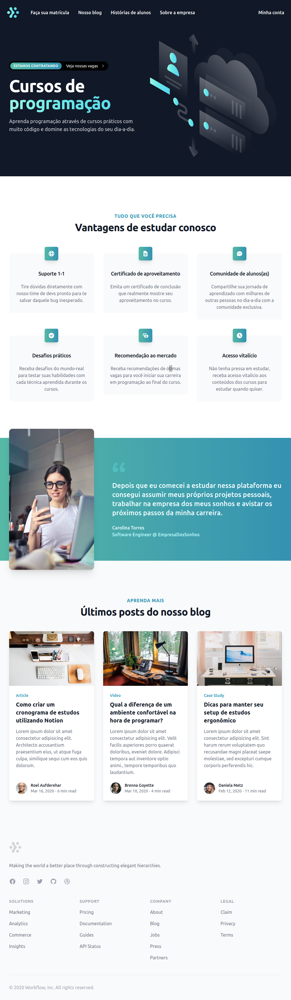
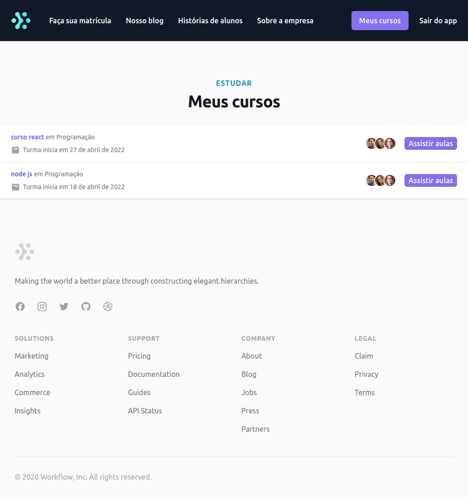
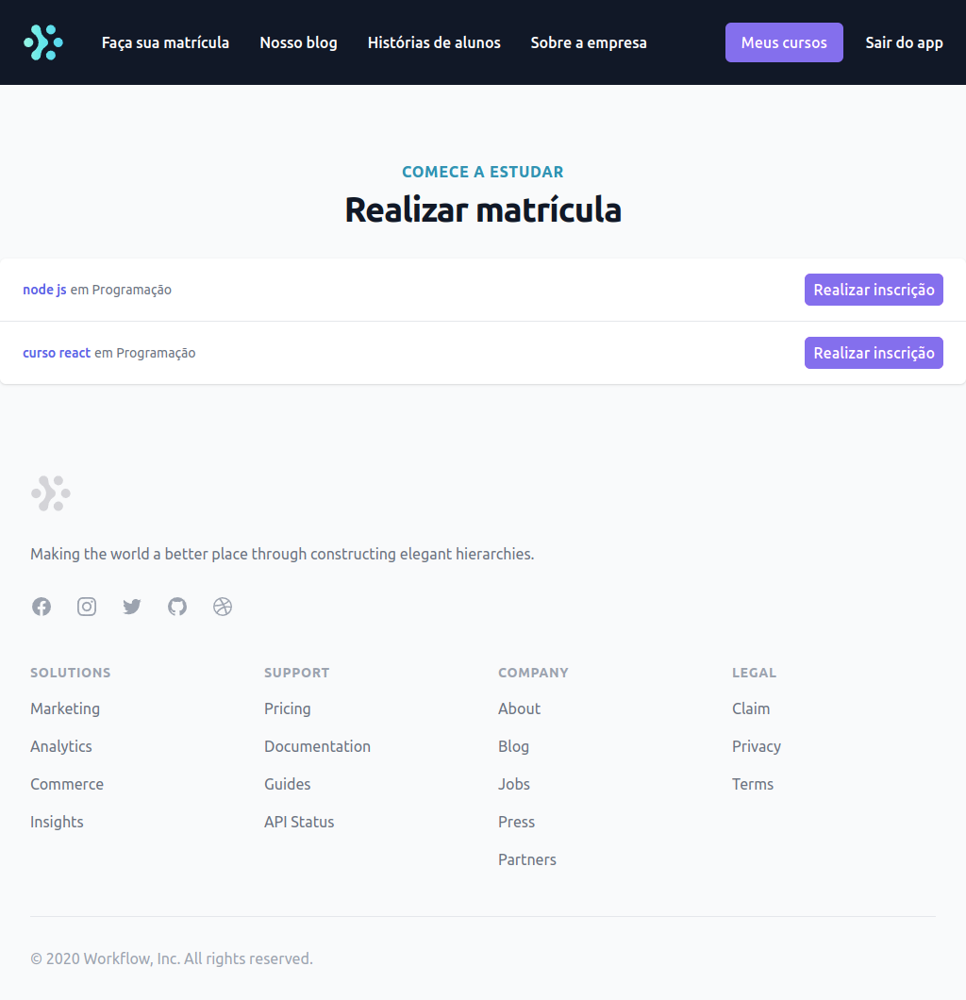
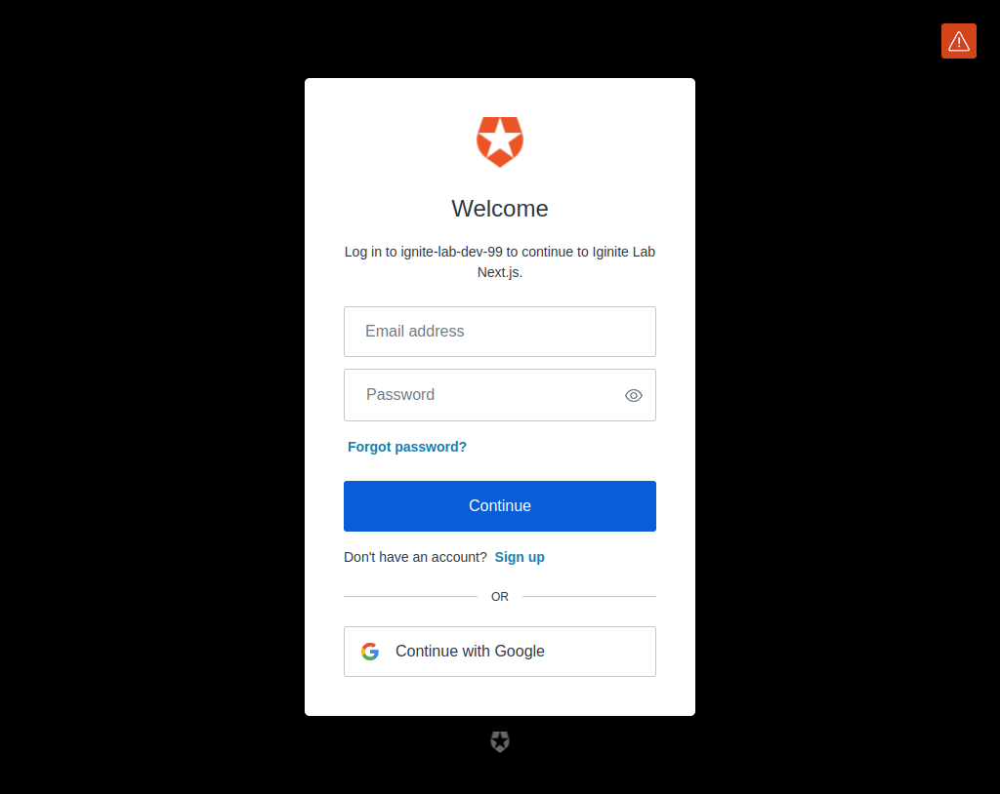

  Ignite Lab - Plataforma de cursos online

  <a href="#sobre">Sobre</a> &#xa0; | &#xa0;
  <a href="#tecnologias">Tecnologias</a> &#xa0; | &#xa0;
  <a href="#prints">Prints</a> &#xa0; &#xa0;

 

<h2 id="sobre">:dart: Sobre</h2>

Plataforma para vendas de produtos digitais (cursos), construída apartir de APIs graphql sendo um serviço responsável pela parte de compras, outro serviço responsável pela parte de cursos e um gateway responsável por centralizar os 2 serviços e servir os dados para o frontend.

<h2 id="tecnologias">:rocket: Tecnologias</h2>

As seguintes tecnologias foram utilizadas no projeto:

<h5>Backend</h5>

- [NestJs](https://nestjs.com/)
- [Prisma](https://www.prisma.io/)
- [Auth0](https://auth0.com/pt)
- [GraphQl](https://graphql.org/)
- [Apache Kafka](https://kafka.apache.org/)
- [Apollo Server](https://www.apollographql.com/docs/apollo-server/)

<h5>Frontend</h5>

- [Next.js](https://nextjs.org/)
- [React.js](https://pt-br.reactjs.org/)
- [Auth0 Client](https://auth0.com/docs/quickstart/spa)
- [Apollo Client](https://www.apollographql.com/docs/react/)

<h2 id="prints">:framed_picture: Prints da Aplicação</h2>

<h1 align="center">
  
  
  
  
</h1>
